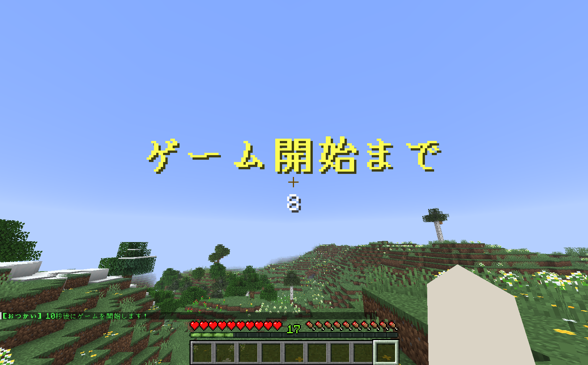
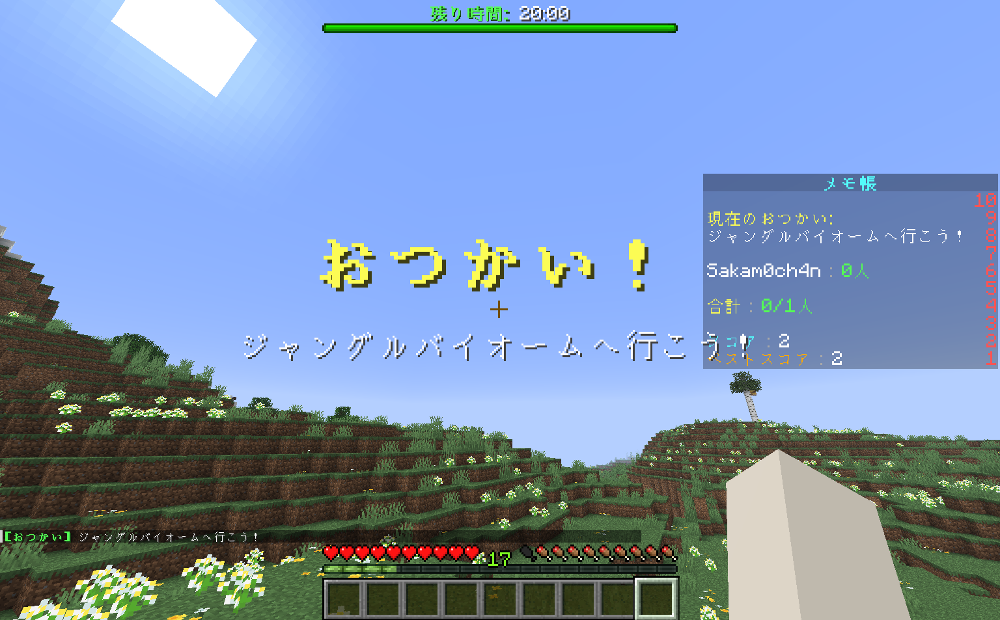
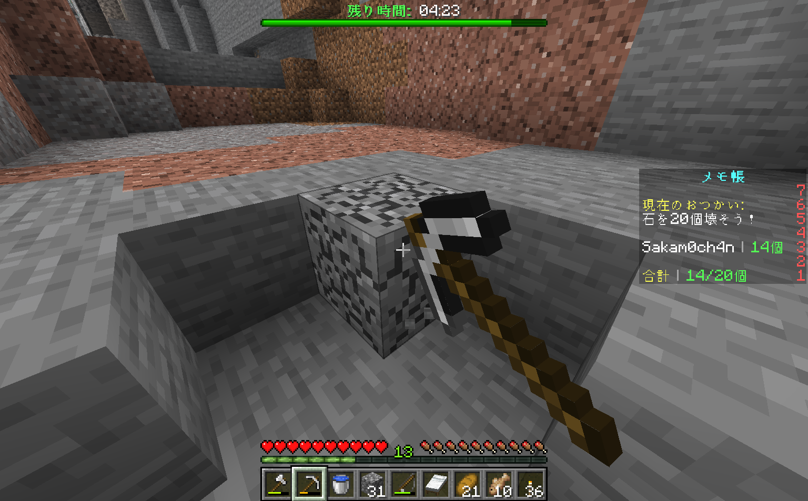
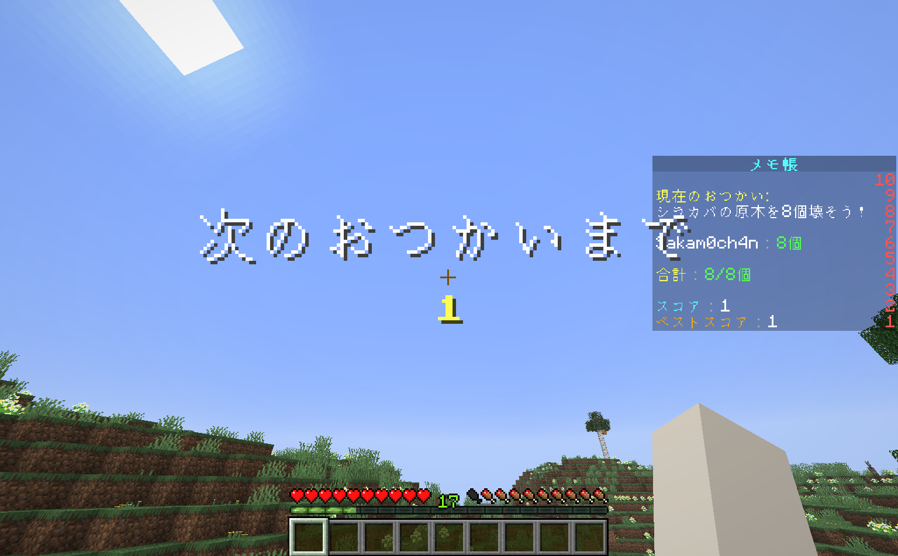

  <h2>Otukai</h2>
  
1.21.10 Paper/Spigot plugin

 

### 概要
サバイバルをテーマに制限時間内に様々なタスクをクリアしていくミニゲームです。  
プレイ人数に応じて、変数が乗算されていく仕組みなので、人数が多いほど難易度が上がります。  
全体の難易度としては、**初心者～中級者** 向けとなっています。  
時間切れになるまでゲームは続きます。`/otukai stop`で終了できます。ベストスコアを目指してみよう。

 

#### コマンド

  <table>
    <tbody>
      <tr>
        <td>/otukai start</td>
        <td>ゲーム開始</td>
      </tr>
      <tr>
        <td>/otukai stop</td>
        <td>ゲーム終了</td>
      </tr>
    </tbody>
  </table>

 
 

### プレイ画像

  <table>
    <thead>
      <tr>
        <th>
            
        </th>
        <th>
            
        </th>
      </tr>
    </thead>
    <tbody>
      <tr>
        <td>
          
        </td>
        <td>
          
        </td>
      </tr>
    </tbody>
  </table>

 
 

### 動作環境

Minecraft 1.21.10 Paper/Spigot

 
 

### 追記

コーディング補助として **Github Copilot** を使用しています。  
Kotlinは良く分かってないので、コードの品質は保証できません。

Release under the MIT License.

 
 

### 著者

Sakamochanq

 
 